 

## Perfil profesional

Estudiante de último curso de **Ingeniería Informática** en la Universidad de La Laguna (Tenerife, España). Mi trabajo se centra en la aplicación de la inteligencia artificial a la medicina, con especial interés en el **modelado predictivo de enfermedades** y la detección temprana mediante visión por computador.

Desarrollo software de forma profesional y trabajo con C++ y Python, combinando rendimiento y rapidez de prototipado en proyectos de aprendizaje automático.

> *El mejor modelo no es el más complejo, sino el que llega al paciente a tiempo.*

## Áreas de interés

## Stack tecnológico

**Lenguajes**

**Inteligencia artificial y ciencia de datos**

**Entorno y herramientas**

## Estadísticas de GitHub

## Trofeos de GitHub

## Contacto

Abierto a colaboraciones en investigación, proyectos de HealthTech y oportunidades profesionales en el ámbito de la IA.

