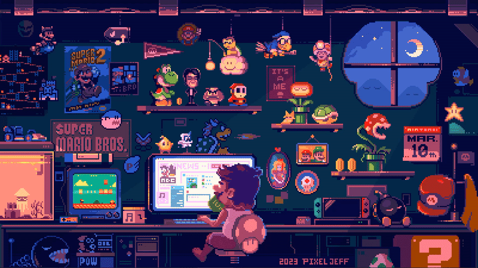

<h1 align="left">Hey 👋 What's up?</h1>

###

<h3 align="center">Building innovative solutions with clean and efficient code</h3>

###

  

###

  

###

  

- 🔭 I’m currently working on **C++**

- 🌱 I’m currently learning **C++ and Python**

- 📫 How to reach me **frannelfran@gmail.com**

- ⚡ Fun fact **I think I am Funny**

<h2 align="left">Connect with me 📲</h2>

###

  
  

###

<h2 align="left">Languages and Tools 👨🏻‍💻</h2>

###

  
  
  
  
  
  
  
  
  
  
  
  
  
  
  
  
  

###

<h2 align="left">Trophies 🏆</h2>

###

  

###

<h2 align="left">Stats 📈</h2>

###

  
  

###

<h2 align="left">Snake 🐍</h2>

###

###
